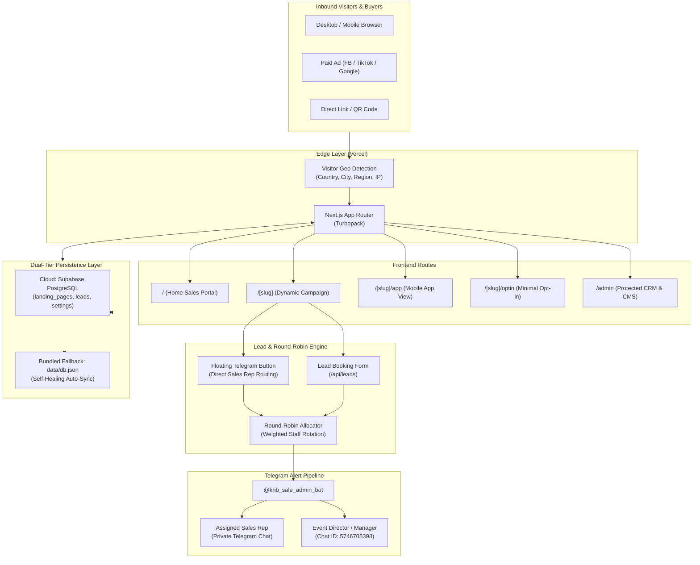
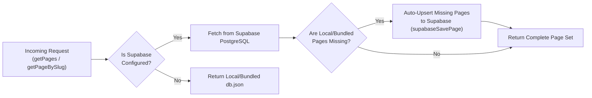

# KHB EVENTS — System Feature Blueprint & Architecture Guide

> **Platform:** `sale.khbevents.com`  
> **Repository:** `sale.khbevents.com`  
> **Version:** 2.4.0 (Production)  
> **Updated:** September 2026  
> **Author:** KHB EVENTS Engineering & Product Team

---

## 1. Executive Overview & Mission

The **KHB EVENTS Sales & Landing Portal** is an enterprise-grade, conversion-optimized multi-campaign landing engine and lead management CRM tailored for Cambodia's premier event management, staging, exhibition, and trade delegation agency.

### Core Objectives
1. **High-Converting Public Face (`/`):** Showcase turnkey event production (4K LED displays, line-array audio, 3D staging, corporate galas, concerts, festivals) with an interactive budget estimator.
2. **Dynamic Campaign Engine (`/[slug]`):** Host isolated, high-converting landing pages for high-ticket B2B delegations (e.g., Vietnam, South Korea), expos, and VIP pass bookings.
3. **Automated Lead Routing:** Distribute inbound prospects through an intelligent Round-Robin engine with weighted quotas, floating Telegram direct redirection, and instant sales staff notifications.
4. **Resilient Dual-Tier Persistence:** Serverless-first architecture combining **Supabase PostgreSQL (Cloud)** with a **Bundled Self-Healing Fallback (`data/db.json`)** to eliminate runtime cold-start and missing-record failures.
5. **Integrated Operator CRM (`/admin`):** End-to-end pipeline management from `NEW` to `WON`/`LOST`, complete with 1-click WhatsApp/Telegram dialers, internal notes, visitor geolocation, and export capabilities.

---

## 2. High-Level System Architecture



---

## 3. Core Subsystems & Feature Breakdown

### 3.1. Landing Page Engine & Template System (`/[slug]`)

Every campaign lives under a dedicated slug (e.g., `/smart-city-tea-cafe`, `/korea-b2b-trip-2026`).

- **Dynamic Template Renderer:** Rendered via `DynamicLandingPageView.tsx`.
- **Alternate Views:**
  - `/[slug]?view=app` or `/[slug]/app`: App-like interface with sticky navigation bars for embedded webviews.
  - `/[slug]?view=optin` or `/[slug]/optin`: Ultra-fast minimal lead capture page for paid ad traffic.
- **Bilingual Support (Khmer & English):**
  - Full toggle between English (`Plus Jakarta Sans`) and Khmer (`Hanuman`, `Kantumruy Pro`).
  - Supports `?lang=kh` or `?lang=en` URL parameters.
  - Khmer text includes customized line-height (`1.8`) for clean typography.

---

### 3.2. Standard 15-Section Dynamic Hierarchy

`DynamicLandingPageView` natively parses and renders any combination of the following sections based on the landing page data:

| # | Section | Purpose | Data Source |
|---|---|---|---|
| 1 | **Hero Section** | High-impact headline, badge, CTA, and official dates/venue | `heroHeadline`, `heroSubheadline`, `heroImage`, `badge` |
| 2 | **Urgency & Scarcity Strip** | Live countdown timer & seats remaining counter (e.g. 11/30 left) | `countdownEnabled`, `urgency` |
| 3 | **Core Values First** | 3 foundational value pillars delivering immediate clarity | `coreValues[]` |
| 4 | **3-Column Problems & Solutions** | Pain points of solo travel vs. KHB B2B group solutions | `problems[]` |
| 5 | **Target Audience** | Breakdown of who should attend (wholesalers, owners, directors) | `audiences[]` |
| 6 | **Interactive Multi-Day Itinerary** | Day-by-day expandable schedule with timeline nodes | `itinerary[]` |
| 7 | **Value Stack** | Complete checklist of all inclusions with individual dollar values | `valueStack` |
| 8 | **Highlights Grid** | Core features (1-on-1 meetings, factory visits, VIP passes) | `highlights[]` |
| 9 | **Pricing Packages & Passes** | Tier cards (Early Bird, Standard, VIP Suite, Corporate) | `packages[]` |
| 10 | **Photo & Video Gallery** | Grid of high-res past event and delegation imagery | `gallery[]`, `videoUrl` |
| 11 | **Testimonials & Social Proof** | Verified quotes from business leaders and Oknha | `testimonials[]` |
| 12 | **100% Risk-Free Guarantee** | Trust badge and reassurance commitments | `guarantee` |
| 13 | **Lead Booking Form** | Direct inquiry form with pre-filled package interest | `formConfig` |
| 14 | **FAQ Accordion** | Frequently asked questions with smooth expand/collapse | `faqs[]` |
| 15 | **Floating Concierge** | Floating WhatsApp / Telegram button connected to Round-Robin | `isolatedSettings`, `settings` |

---

### 3.3. Isolated Campaign Settings (`isolatedSettings`)

Each landing page can override global system settings to remain completely self-contained:

```typescript
isolatedSettings: {
  phone: "+855 12 888 999",
  whatsapp: "+85512888999",
  whatsappNumber: "85512888999",
  telegramUsername: "khb_sale_admin_bot",
  coordinatorName: "Chamnab Mey",
  coordinatorRole: "Senior Trade Mission Director",
  partnerName: "Korea Trade Alliance & Seoul Exhibition Bureau",
  customCtaText: "កក់កៅអី VIP ទៅកូរ៉េ ($750)",
  customThankYouMessage: "សូមអរគុណ! ការកក់កៅអីត្រូវបានទទួលជោគជ័យ...",
  postSubmitAction: "inline", // "inline" | "redirect"
  leadTags: ["b2b-korea", "camping-outdoor", "eyewear-optics", "office-gifts"],
  enableTelegramAlerts: true,
  accessProtection: "public", // "public" | "password"
  accentColor: "#2563EB"
}
```

---

### 3.4. Dual-Tier Persistence & Self-Healing Sync



#### Why This Is Critical
1. **Serverless Bundling:** `bundledDbJson` is imported directly in `src/lib/storage.ts`, ensuring Turbopack/Webpack embeds all pages into the JavaScript bundle. Filesystem read errors (`ENOENT`) on Vercel are impossible.
2. **Self-Healing Cloud Seeding:** When a developer or agent adds a new page to `data/db.json`, the first visitor or admin call to `getPages()` or `getPageBySlug()` automatically detects that the slug is missing in Supabase, calls `supabaseSavePage(localPage)`, and synchronizes it permanently to Supabase cloud.
3. **No Migration Bottleneck:** Non-standard fields (`urgency`, `itinerary`, `coreValues`, `valueStack`, `translations`, `isolatedSettings`) are automatically packaged inside `form_config._extra` when writing to Supabase, and unpacked on retrieval. No manual SQL `ALTER TABLE` is required.

---

### 3.5. Round-Robin Sales Allocation & Routing Engine

Located in `src/lib/round-robin.ts`.

- **Equal or Weighted Distribution:** Each active sales rep is allocated a percentage weight (e.g. 5 reps @ 20% each).
- **Sequential Pointer (`currentIndex`):** Maintains rotation index across requests.
- **Floating Contact Routing (`/api/round-robin/route`):**
  - When a visitor clicks the floating Telegram icon on a campaign page, the endpoint assigns the next sales rep, logs the lead click, fires a real-time Telegram notification, and immediately redirects the user to `https://t.me/<assigned_staff_username>`.
- **API Endpoints:**
  - `GET /api/round-robin`: Current settings and roster.
  - `POST /api/round-robin/route?page=<slug>&redirect=true`: Allocation and direct redirect.
  - `POST /api/round-robin/test`: Test dispatch to staff Telegram chats.
  - `POST /api/round-robin/simulate`: Preview simulated distribution of 100 leads.
  - `GET /api/round-robin/logs`: Audit log of all lead allocations.

---

### 3.6. Telegram Sales Bot Integration

- **Official Bot:** `@khb_sale_admin_bot`
- **Bot Token:** Configured in environment `TELEGRAM_BOT_TOKEN` or Admin Settings.
- **Delivery Workflow:**
  1. **Assigned Sales Rep:** Receives private Telegram alert with client name, phone, email, package interest, and 1-click WhatsApp/CRM action buttons.
  2. **Event Director / Manager Fallback (`5746705393`):** Receives the lead summary ensuring no buyer inquiry is lost even if a sales rep is offline.
- **Webhook Endpoint:** `/api/telegram/webhook` (configured via `/api/telegram/setup-webhook`).

---

### 3.7. Automatic Visitor Demographics & Geolocation

Located in `src/app/api/leads/route.ts` and `src/lib/storage.ts`.

Inbound requests automatically inspect edge headers:
- `x-vercel-ip-country` or `cf-ipcountry` $\rightarrow$ Visitor Country (e.g. `KH`, `VN`, `KR`, `US`).
- `x-vercel-ip-city` $\rightarrow$ Visitor City (e.g. `Phnom Penh`, `Ho Chi Minh City`, `Seoul`).
- `x-vercel-ip-country-region` $\rightarrow$ Visitor Region.
- `x-forwarded-for` / `x-real-ip` $\rightarrow$ IP Address.

The CRM automatically formats country flags:
- 🇰🇭 Cambodia (`KH`)
- 🇻🇳 Vietnam (`VN`)
- 🇰🇷 South Korea (`KR`)
- 🇺🇸 United States (`US`)
- 🇨🇳 China (`CN`)

---

### 3.8. Operator CRM & Admin Portal (`/admin`)

- **Authentication:** Protected session cookies, SHA-256 hashed credentials.
- **Dashboard Overview (`/admin`):** KPIs for total leads, active campaigns, tracked page views, and conversion rates.
- **Lead Pipeline CRM (`/admin/leads`):**
  - **Status Transitions:** `NEW` $\rightarrow$ `CONTACTED` $\rightarrow$ `PROPOSAL_SENT` $\rightarrow$ `NEGOTIATING` $\rightarrow$ `WON` $\rightarrow$ `LOST`.
  - **Direct Actions:** 1-Click WhatsApp chat with pre-filled message, phone dialer.
  - **Notes History:** Chronological team notes per lead.
  - **Lead Deletion:** Safely deletes from both Supabase PostgreSQL and local storage.
  - **CSV Export:** 1-click export for Excel or Google Sheets.
- **Landing Page CMS (`/admin/pages`):**
  - View all active/archived pages, create new pages, duplicate, edit, or delete.
  - Per-page analytics: conversion rate, view count, leads count.
- **Round-Robin Manager (`/admin/round-robin`):**
  - Add/remove sales staff, toggle active status, adjust percentage weights.
- **System Settings (`/admin/settings`):**
  - Contact info, company address, bot credentials, password changes.

---

## 4. Current Active Campaign Registry

| Campaign Name | Slug | Sector / Target | Event Dates | Pricing | Status |
|---|---|---|---|---|---|
| **Vietnam Smart City, Tea & Cafe** | `smart-city-tea-cafe` | Smart City Tech, High-Tech Agriculture, Cafe Franchise | Oct 8-11, 2026 (4D3N) | Early Bird: $499<br>Standard: $550 | Published |
| **Korea B2B Business Delegation** | `korea-b2b-trip-2026` | Camping & Outdoor (GOCAF), Eyewear (K-Optics), Premium Gifts (SIPREMIUM) | Nov 25-28, 2026 (4D3N) | Early Bird: $750<br>Standard: $799 | Published |

---

## 5. Codebase Directory Map

```text
sale.khbevents.com/
├── data/
│   └── db.json                       <-- Bundled seed database (pages, leads, settings)
├── public/
│   ├── images/                       <-- Static graphic assets & banners
│   └── photos/                       <-- High-res event & delegation photography
├── scripts/
│   ├── sync-to-supabase.mjs          <-- Manual database sync script
│   └── verify-supabase.mjs           <-- Supabase connection & anon/service verification
├── src/
│   ├── app/
│   │   ├── [slug]/                   <-- Dynamic campaign landing route
│   │   │   ├── page.tsx              <-- Server component & metadata generator
│   │   │   ├── app/page.tsx          <-- Mobile app webview mode
│   │   │   └── optin/page.tsx        <-- Fast opt-in mode
│   │   ├── admin/                    <-- Admin portal routes
│   │   │   ├── leads/page.tsx        <-- Lead CRM pipeline & CSV export
│   │   │   ├── pages/page.tsx        <-- Landing page CMS list
│   │   │   ├── round-robin/page.tsx  <-- Sales distribution manager
│   │   │   ├── settings/page.tsx     <-- System settings & bot config
│   │   │   └── page.tsx              <-- Admin overview dashboard
│   │   ├── api/
│   │   │   ├── leads/                <-- Lead capture & deletion endpoints
│   │   │   ├── pages/                <-- Landing page CRUD endpoints
│   │   │   ├── round-robin/          <-- Round-Robin routing & test endpoints
│   │   │   └── telegram/             <-- Telegram bot webhook endpoints
│   │   ├── layout.tsx                <-- Root layout with fonts & providers
│   │   └── page.tsx                  <-- Flagship home sales portal
│   ├── components/
│   │   ├── admin/                    <-- Admin UI components
│   │   └── landing/                  <-- Dynamic & static landing page components
│   │       ├── DynamicLandingPageView.tsx  <-- Primary dynamic page engine
│   │       ├── FloatingContact.tsx         <-- Telegram/WhatsApp floating routing
│   │       ├── LeadForm.tsx                <-- Lead capture form
│   │       ├── CampaignsShowcase.tsx       <-- Home featured campaigns grid
│   │       └── ...
│   └── lib/
│       ├── round-robin.ts            <-- Round-Robin algorithm & Telegram dispatches
│       ├── storage.ts                <-- Unified storage engine with auto-sync
│       ├── supabase-store.ts         <-- Supabase CRUD operations & row mappers
│       ├── supabase.ts               <-- Supabase client singleton
│       └── types.ts                  <-- TypeScript interfaces & domain schemas
├── supabase/
│   └── schema.sql                    <-- PostgreSQL schema definition & indexes
├── FEATURE_BLUEPRINT.md              <-- This authoritative architecture guide
└── README.md                         <-- Project quickstart documentation
```

---

## 6. Standard Operating Procedures (SOPs) for System Updates

### SOP 1: How to Add a New Landing Page / Business Delegation

When creating a new business delegation (e.g. Japan, Germany, China):

1. **Add Page Object to `data/db.json`:**
   - Provide a unique `id` (`page-<destination>-<year>`) and `slug` (`destination-b2b-trip-<year>`).
   - Fill in bilingual content, 4 itinerary days, 8 value stack inclusions, pricing packages, FAQs, and `isolatedSettings`.
2. **Execute Supabase Sync Script:**
   ```bash
   node scripts/sync-to-supabase.mjs
   ```
   *(Note: Even if this step is skipped, the auto-sync logic in `src/lib/storage.ts` will automatically push the new page to Supabase on first access).*
3. **Verify Supabase Status:**
   ```bash
   node scripts/verify-supabase.mjs
   ```
4. **Run Build Verification:**
   ```bash
   npm run build
   ```
5. **Commit and Deploy:**
   ```bash
   git add -A
   git commit -m "feat(landing): add <Destination> B2B Business Delegation landing page"
   git push origin main
   ```
   *Vercel will auto-deploy the page live within 60 seconds.*

---

### SOP 2: How to Add or Update Sales Team Members in Round-Robin

1. **Via Admin Dashboard (Recommended):**
   - Navigate to `https://sale.khbevents.com/admin/round-robin`.
   - Add new staff member with their **Name**, **Telegram Username** (without `@`), and **Percentage Weight**.
   - Ensure the total weights sum to 100%.
2. **Via Code/Database (`data/db.json`):**
   - Update `settings.roundRobinSettings.staffList` in `data/db.json`.
   - Run `node scripts/sync-to-supabase.mjs` and deploy.

---

### SOP 3: How to Update or Rotate Telegram Bot Tokens

If the Telegram Bot token needs to be replaced:

1. Obtain new token from `@BotFather`.
2. Update the token in `.env.local`:
   ```env
   TELEGRAM_BOT_TOKEN="<new-bot-token>"
   ```
3. Update Vercel Environment Variables:
   - Go to Vercel Project Settings $\rightarrow$ Environment Variables.
   - Update `TELEGRAM_BOT_TOKEN`.
4. Run Webhook Setup:
   ```bash
   curl -X POST https://sale.khbevents.com/api/telegram/setup-webhook
   ```

---

### SOP 4: How to Deploy and Verify Production

1. Always run `npm run build` locally before pushing to prevent deployment breaks.
2. After pushing to `main`, verify:
   - Production API: `https://sale.khbevents.com/api/pages` returns all published pages.
   - New Landing Page: `https://sale.khbevents.com/<slug>` returns HTTP 200.
   - Homepage: `https://sale.khbevents.com/#campaigns` includes the campaign card.

---

## 7. Environment Variables Reference

| Variable Name | Environment | Description | Example |
|---|---|---|---|
| `NEXT_PUBLIC_SUPABASE_URL` | Client & Server | Supabase project endpoint URL | `https://xyz.supabase.co` |
| `SUPABASE_SERVICE_ROLE_KEY` | Server Only | High-privilege key for CRM bypass of RLS | `eyJh...` |
| `NEXT_PUBLIC_SUPABASE_ANON_KEY` | Client & Server | Public anon key for visitor reads | `eyJh...` |
| `TELEGRAM_BOT_TOKEN` | Server Only | HTTP API Token from `@BotFather` | `8808252369:AAH...` |
| `TELEGRAM_CHAT_ID` | Server Only | Default manager chat or group ID | `5746705393` |
| `NEXT_PUBLIC_BASE_URL` | Client & Server | Canonical domain of the application | `https://sale.khbevents.com` |

---

## 8. Design Guardrails & Anti-Patterns

1. ❌ **DO NOT** use generic tech purple/pink gradients; strictly stick to KHB Events' **Emerald Forest** (`#091E14`, `#0F2E20`, `#277856`), **Champagne Gold** (`#E5A93C`), and **Deep Obsidian Black**.
2. ❌ **DO NOT** bypass `storage.ts` by writing ad-hoc filesystem calls in route files; always use `getPages()`, `savePage()`, and `createLead()`.
3. ❌ **DO NOT** remove `form_config._extra` packing in `supabase-store.ts`; it is the linchpin that allows rich dynamic features without brittle database migrations.
4. ✅ **ALWAYS** verify bilingual rendering (Khmer font scaling and line spacing) when adding or modifying landing page components.
