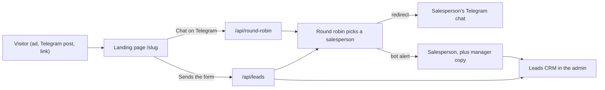

# System Map

sale.khbevents.com is the sales portal of KHB Events. For sales it does three jobs:

1. It shows one landing page per trip or event, with price, seats, programme and a form.
2. It turns visitors into leads, either through the form or through a "Chat on Telegram" button.
3. It hands every lead to a salesperson fairly and alerts them on Telegram.

Everything else (popups, tracking, languages) supports those three jobs. Business context lives in [[KHB Events Company Profile]] and [[Sales Playbook]].

## The stack

| Part | What we use | Where it is set |
|---|---|---|
| Web framework | Next.js 16.3.5 (App Router) | `package.json` |
| UI library | React 19.2.8 | `package.json` |
| Styling | Tailwind CSS v4, lucide-react icons | `package.json` |
| Language | TypeScript 5 | `package.json` |
| Tests | Vitest (`npm test`) | `package.json`, `src/lib/__tests__/` |
| Database, file storage, client sign-in | Supabase | `src/lib/supabase.ts`, `supabase/schema.sql` |
| Hosting | Vercel, server functions in region `sin1` (Singapore) | `vercel.json` |
| Alternative hosting | cPanel Node.js app started with `server.js` (`npm run start:cpanel`) | `CPANEL_DEPLOYMENT.md` |

This Next.js version has breaking changes compared with older ones. Developers read `AGENTS.md` and the docs in `node_modules/next/dist/docs/` before changing code.

## How changes reach the live site

- Code goes straight to the `main` branch, with no pull requests.
- A push to `main` on GitHub deploys to production on Vercel automatically.
- Every change is verified locally first (typecheck, lint, tests, build, browser check), and the live site is checked after the deploy.
- A push that only changes `docs/` or `CLAUDE.md` skips the Vercel build (`ignoreCommand` in `vercel.json` runs `scripts/vercel-ignore-build.sh`). Anything uncertain builds.

Steps: [[Verify Changes Locally]], then [[Deploy to Production]].

## Public pages (what visitors see)

| Path | What it is |
|---|---|
| `/` | Home page of the sales portal. Lists published pages that have no passcode. Popups target it under the name `main-sales`. |
| `/<slug>` | One landing page from the CMS, for example `/smart-city-tea-cafe`. See [[Landing Pages CMS]]. |
| `/smart-city-tea-cafe/app` or `?view=app` | Phone "app" layout of the Smart City page. Exists only for this slug. |
| `/smart-city-tea-cafe/optin` or `?view=optin` | Short opt-in layout of the Smart City page. Exists only for this slug. |
| `/login` | Client sign-in page (Supabase Auth). `/auth/callback` finishes the sign-in. |
| `/photos/...` | Old image links, redirected to `/images/events/...` (`next.config.ts`). |

Rules for `/<slug>` (`src/lib/page-access.ts`):

- A **draft** page is visible only to a logged-in admin (for previews).
- An **archived** page returns "not found" to everyone.
- A page with a passcode shows a lock screen until the visitor enters it. See [[Admin and Security]].

Useful URL switches:

| Add to a page URL | Effect | Note |
|---|---|---|
| `?lang=kh` | Opens the Smart City page in Khmer. On other pages it changes only the page title, the link-preview text and popups | [[Languages]] |
| `?popup_preview=<popup id>` | Shows that popup at once, not counted | [[Ads and Popups]] |
| `?nopopup=1` | Hides all popups | [[Ads and Popups]] |
| `?utm_source=...&utm_campaign=...` | Records the ad source on views and leads | [[Tracking and Analytics]] |

## Admin pages

Every admin page checks the login and sends anyone without a session to `/admin/login`.

| Path | Sidebar menu | What you do there |
|---|---|---|
| `/admin/login` | (sign-in screen) | Log in |
| `/admin` | Dashboard | Totals: inquiries, active pages, tracked views, conversion rate |
| `/admin/pages` | Landing Pages CMS | List, create, duplicate, import, delete pages |
| `/admin/pages/new` | + Create New Page | Start a new page from a template |
| `/admin/pages/<id>` | (edit a page) | The page editor |
| `/admin/pages/<id>/analytics` | Page Tracking & Analytics | Funnel, sources, devices, languages for one page |
| `/admin/leads` | Leads & CRM Pipeline | Work the leads. `?status=NEW` filters, `?id=<lead id>` opens one lead |
| `/admin/round-robin` | Staff Round Robin | Sales team, shares, routing rules, routing log |
| `/admin/ads` | Ads & Popups | Popups on the landing pages and their stats |
| `/admin/settings` | Settings & Security | Company contacts, Telegram bot, theme and language, password |
| `/admin/guide` | User Guide & Blueprint | In-app operator guide |

## Where the data lives

**Supabase is the real database in production.** It has four tables (`supabase/schema.sql`):

| Table | Holds |
|---|---|
| `landing_pages` | One row per landing page. Newer page fields are kept inside `form_config` under `_extra`. |
| `leads` | One row per lead. |
| `system_settings` | Company settings in the row with id `default` (includes the bot token and the admin password hash). |
| `page_views` | One row per page view (page and referrer only). |

Several features store their data as a JSON text in extra rows of `system_settings` (`src/lib/supabase-store.ts`). No migration is needed for them.

| Row id in `system_settings` | Holds | Feature |
|---|---|---|
| `round_robin` | Sales team, shares and routing rules | [[Round Robin]] |
| `round_robin_logs` | The latest 200 routing log entries | [[Round Robin]] |
| `popup_ads` | All popups and the popup master settings | [[Ads and Popups]] |
| `popup_ad_stats` | Views, clicks and closes per popup | [[Ads and Popups]] |
| `deleted_pages` | Pages the admin deleted, so they are not re-created | [[Landing Pages CMS]] |
| `telegram_webhook_secured` | Proof that the bot webhook was secured | [[Admin and Security]] |
| `content_pack:<slug>` and `content_pack_backup:<slug>` | Which content pack version was applied, and the page before it | [[Content Packs]] |

Uploaded images live in the Supabase Storage bucket `page-images`. See [[Image Uploads]].

**`data/db.json` is the fallback and the seed.** (`src/lib/storage.ts`)

- Without Supabase settings (local development, or a cPanel install without Supabase) the app reads and writes this JSON file instead.
- On Vercel the file cannot be written in place, so it is copied to the server's temporary folder `/tmp`. Anything written only there is lost when the server instance stops.
- Pages in the bundled file that are missing in Supabase are copied into Supabase automatically, unless the admin deleted them.
- The file must never hold real secrets or customer data in git. See [[Rotate the Telegram Bot Token]].

**Public pages read through a 60-second cache.** Settings, pages and popups are cached for 60 seconds so a page view does not hit the database each time. Admin saves clear the cache, so an admin change normally shows at once; allow up to a minute. Leads and round robin settings are not cached.

## How a request flows

1. A visitor opens `/smart-city-tea-cafe` from an ad, a Telegram post or a shared link.
2. The server loads the page, the popups for that page and the public company settings. Secrets (bot token, chat IDs, passcode, password hash, staff routing data) are removed before anything reaches the browser (`getPublicSettings` in `src/lib/storage.ts`, `toPublicPage` in `src/lib/page-access.ts`).
3. The browser sends tracking events (view, scroll, clicks) to `/api/track`.
4. The visitor either:
   - taps **Chat on Telegram**: `/api/round-robin` picks a salesperson and redirects the visitor straight into that person's Telegram chat; alerts go out after the redirect; or
   - sends the **form**: `/api/leads` saves the lead, picks a salesperson and sends them a Telegram alert with the lead card.
5. The salesperson follows up and moves the lead through the pipeline in [[Leads CRM]].

## API routes (for developers)

| Route | Who may call it | Purpose |
|---|---|---|
| `POST /api/leads` | Anyone (rate limited) | Form submission |
| `GET /api/leads`, `/api/leads/<id>` | Admin | Read, update status, add note, delete |
| `GET /api/round-robin?page=<slug>` | Anyone (rate limited) | Telegram click routing and redirect |
| `/api/round-robin/settings`, `/logs`, `/simulate`, `/test` | Admin | Round robin screen |
| `POST /api/track` | Anyone (rate limited) | Tracking beacons |
| `/api/popup-ads`, `/api/popup-ads/stats` | Admin | Popup editor and counters |
| `/api/pages`, `/api/pages/<id>`, `/api/pages/<id>/analytics` | Admin | Page CMS |
| `POST /api/pages/unlock` | Anyone (rate limited) | Passcode check for protected pages |
| `/api/uploads` | Admin | Image upload and library |
| `GET /api/uploads/<name>` | Anyone | Serves images uploaded in local development only; production images come from Supabase Storage |
| `/api/settings` | Admin | Company settings, bot token, password |
| `/api/auth/login`, `/logout`, `/check` | Login is public (rate limited) | Admin session |
| `POST /api/telegram/webhook` | Telegram | Bot messages |
| `/api/telegram/setup-webhook` | Admin | Register and secure the bot webhook |

## Feature notes

| Note | In one line |
|---|---|
| [[Landing Pages CMS]] | Build and publish trip pages without code |
| [[Leads CRM]] | Every inquiry, its status, notes and export |
| [[Round Robin]] | Fair sharing of leads and Telegram chats among sales staff |
| [[Ads and Popups]] | Promotional popups on the landing pages |
| [[Languages]] | English and Khmer, on public pages and in the admin |
| [[Image Uploads]] | Upload buttons on image fields |
| [[Content Packs]] | Page copy kept in git and applied on deploy |
| [[Tracking and Analytics]] | Views, clicks, funnel and ad pixels |
| [[Admin and Security]] | Login, roles, passcodes, rate limits, secrets |

Runbooks: [[Deploy to Production]], [[Verify Changes Locally]], [[Launch a New Trip Page]], [[Add a Sales Staff Member]], [[Create a Popup]], [[Change the Admin Password]], [[Rotate the Telegram Bot Token]], [[Run the RLS Lockdown Migration]].

## To confirm

- Is a cPanel install still in use anywhere, or is Vercel the only live host?
- `README.md` and `FEATURE_BLUEPRINT.md` describe some older behaviour. Where they disagree with this note, the code wins. Should they be updated? (Track in [[Open Tasks]].)
